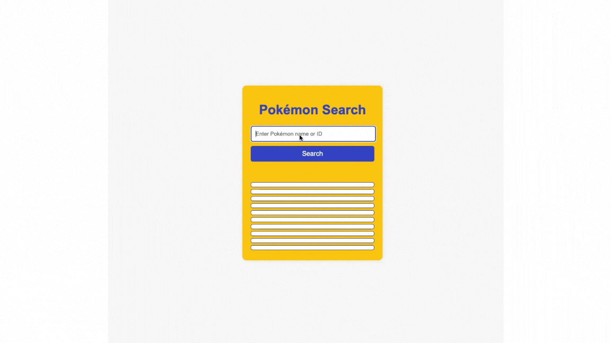

# Pokémon Search App (Deployed)

This repository contains a simple web application that allows users to search for Pokémon by name or ID using the Pokémon API. The application retrieves and displays various details about the Pokémon, including its stats, types, and sprite.

This project was done as part of [JavaScript Algorithm and Data Structures Certification](https://www.freecodecamp.org/certification/opin/javascript-algorithms-and-data-structures-v8), which teaches JavaScript fundamentals like variables, arrays, objects, loops, functions, the DOM, Object Oriented Programming (OOP), Functional Programming, algorithmic thinking, how to work with local storage, and how to fetch data using an API.

## Table of Contents

[Result](#result) | [Features](#features) | [Technologies Used](#technologies-used) | [Installation](#installation) | [Usage](#usage) |
## Result

## Features

### Pokémon Data Display

- **Basic Information**: Displays Pokémon's name, sprite, ID, weight, and height.
- **Stats**: Shows detailed stats including HP, Attack, Defense, Special Attack, Special Defense, and Speed.
- **Types**: Displays the primary type of the Pokémon.

### User Interaction

- **Search Functionality**: Users can enter a Pokémon's name or ID into an input field and click a button to fetch and display Pokémon data.
- **Clear Fields**: Automatically clears the previous Pokémon details when a new search is performed. This feature is clearly visible when a user enters an invalid pokemon name or ID. 

### Responsive Design

- **Container Sizing**: Adjusts to fit different screen sizes, ensuring the app looks good on both mobile and desktop devices.
- **Flexible Layout**: Elements are arranged to provide a user-friendly experience across various devices.

### Error Handling

- **Error Alerts**: If the Pokémon is not found, an alert notifies the user of the issue, ensuring a smooth experience even if the search fails.

## Technologies Used

- HTML
- CSS
- JavaScript
- Fetch API

## Installation

1. Clone the repository.
2. Navigate to the project directory.
3. Open `index.html` in your web browser to view the application.

## Usage

### Viewing Pokémon Data

To view Pokémon data, open `index.html` in your web browser. Enter a Pokémon's name or ID into the input field and click the "Search" button. The application will display the Pokémon's information below.

### Editing the Code

To modify the application's functionality or appearance:

- **HTML**: Edit the `index.html` file to change the structure or content of the page.
- **CSS**: Edit the `styles.css` file to adjust the styling and layout. Adjust colors, fonts, and layout properties to match your desired look and feel.
- **JavaScript**: Edit the `script.js` file to change the logic or functionality of the application.

